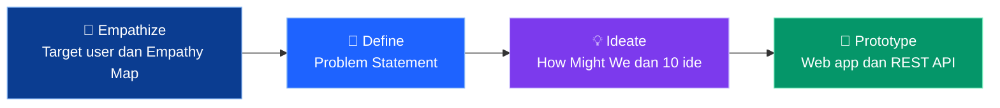
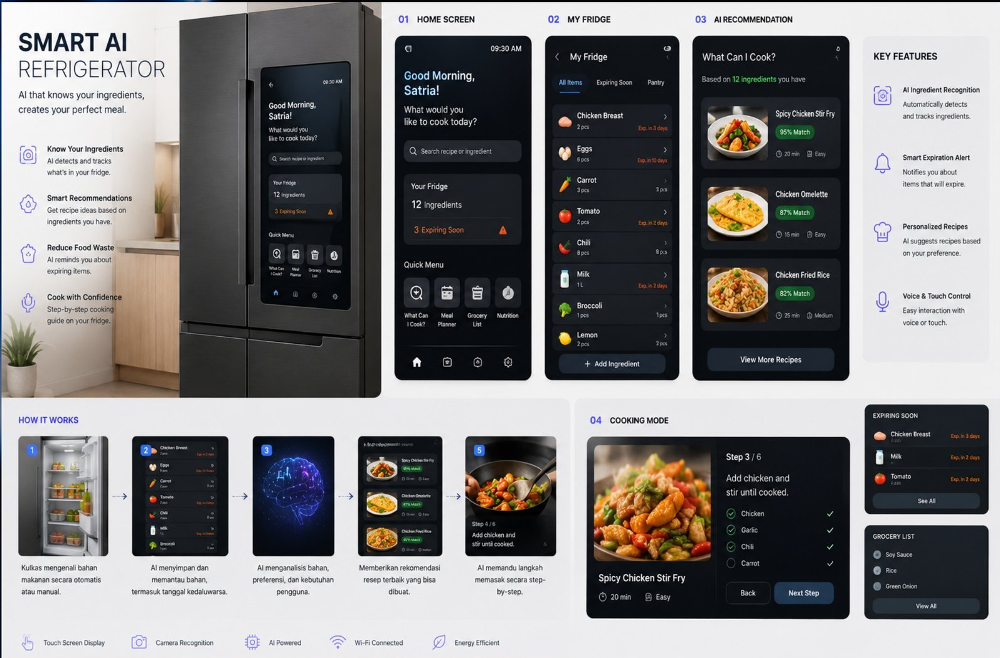
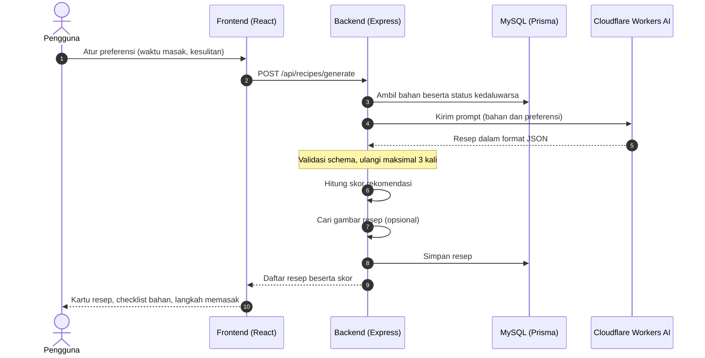
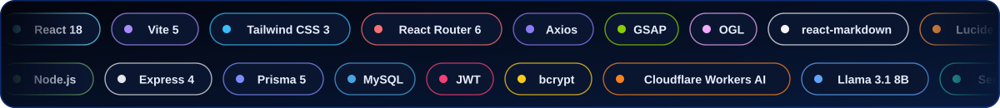
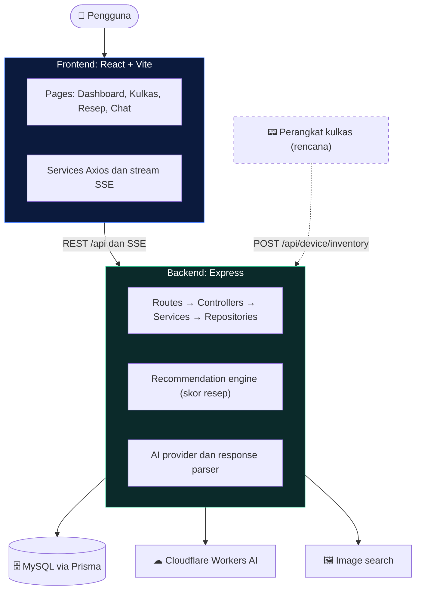

<div align="center">



<br>


<br><br>


</div>


## 📌 Ringkasan

**Smart AI Refrigerator** adalah konsep kulkas yang memakai AI untuk memahami bahan makanan yang tersedia, lalu merekomendasikan makanan yang bisa dibuat dari bahan tersebut.

Repository ini berisi **prototype pada software layer**: aplikasi web (`frontend`) dan REST API (`backend`) yang menjalankan inti idenya, yaitu mencatat isi kulkas, memantau kedaluwarsa, membuat resep dengan AI, dan mengobrol dengan asisten dapur.

> [!IMPORTANT]
> **Ini prototype, bukan produk jadi.** Bagian perangkat keras (layar sentuh di pintu kulkas, kamera, sensor suhu, Wi-Fi) belum dibuat. Proyek ini menjawab satu pertanyaan: *seperti apa pengalaman perangkat lunaknya jika kulkas benar-benar cerdas?* Bagian mana yang sudah jalan dan mana yang masih rencana dijelaskan secara terbuka di [Status Fitur](#-status-fitur-prototype) dan [Batasan Prototype](#-batasan-prototype).

**Untuk siapa?** Orang yang sering memasak di rumah, misalnya mahasiswa, ibu rumah tangga, atau siapa pun yang punya bahan di kulkas tetapi bingung mau masak apa dan lupa bahan apa yang masih ada.

### Navigasi cepat

| Ingin tahu... | Buka |
| --- | --- |
| **Kenapa** proyek ini dibuat | [Dari Design Thinking ke Kode](#-dari-design-thinking-ke-kode) |
| Fitur mana menjawab masalah apa | [Pain Point Menjadi Fitur](#-pain-point-menjadi-fitur) |
| **Bagaimana** alurnya bekerja | [Cara Kerja](#-cara-kerja) |
| Teknologi yang dipakai | [Tech Stack](#-tech-stack) |
| Cara menjalankan di komputer | [Menjalankan Secara Lokal](#-menjalankan-secara-lokal) |
| Detail API dan konfigurasi backend | [`smart-ai-refrigerator-backend/README.md`](smart-ai-refrigerator-backend/README.md) |
| Detail UI dan konfigurasi frontend | [`smart-ai-refrigerator-frontend/README.md`](smart-ai-refrigerator-frontend/README.md) |


## 🧠 Dari Design Thinking ke Kode

Proyek ini berawal dari tugas individu **Design Thinking**. Setiap keputusan produk di repository ini bisa ditelusuri kembali ke salah satu tahap berikut.



<details open>
<summary><b>🔎 1. Empathize</b> — siapa penggunanya dan apa yang mereka rasakan</summary>

<br>

**Primary user:** orang yang sering memasak di rumah (mahasiswa, ibu rumah tangga, atau siapa pun yang bingung saat ingin memasak sesuatu).
**Karakteristik:** punya bahan makanan di kulkas, tetapi sering bingung mau masak apa dan tidak tahu bahan apa saja yang masih tersedia.

| 🗣️ Says | 💭 Thinks | 🖐 Does |
| --- | --- | --- |
| “Di kulkas masih banyak bahan, tapi nggak tahu mau masak apa.”<br>“Bahan ini masih ada nggak ya?”<br>“Sayang kalau bahan makanan ini sampai terbuang.” | “Bisa masak apa dengan bahan yang ada?”<br>“Resep ini butuh bahan yang ternyata nggak punya.”<br>“Kalau beli bahan tambahan, jadi lebih mahal.” | Membuka kulkas untuk mengecek bahan secara manual.<br>Mencari resep lewat Google, TikTok, atau YouTube.<br>Membeli bahan tambahan karena resep tidak sesuai dengan bahan yang tersedia. |

| 😟 Feel | 🔥 Pain | 🌱 Gains |
| --- | --- | --- |
| Bingung menentukan menu, malas mengecek isi kulkas satu per satu, dan khawatir bahan makanan terbuang karena lupa atau tidak segera digunakan. | Tidak tahu bahan apa saja yang tersedia.<br>Bingung menentukan menu.<br>Resep sering membutuhkan bahan yang tidak dimiliki. | Mengetahui isi kulkas dengan mudah.<br>Mendapat rekomendasi makanan berdasarkan bahan yang tersedia.<br>Mengurangi pembelian bahan yang tidak diperlukan.<br>Mengurangi food waste. |

</details>

<details open>
<summary><b>🎯 2. Define</b> — masalah yang ingin diselesaikan</summary>

<br>

> Pengguna sering kesulitan menentukan makanan yang dapat dibuat dari bahan yang tersedia karena mereka tidak mengetahui seluruh isi kulkas, lupa dengan bahan yang dimiliki, dan menemukan resep yang membutuhkan bahan tambahan. Hal ini dapat menyebabkan pembelian yang tidak perlu dan bahan makanan terbuang.

</details>

<details open>
<summary><b>💡 3. Ideate</b> — dari pertanyaan ke ide terpilih</summary>

<br>

**How Might We:** *Bagaimana kita dapat memanfaatkan AI untuk memberikan rekomendasi makanan yang sesuai dengan bahan, preferensi, dan kondisi makanan yang tersedia di kulkas?*

**Hasil brainstorming (10 ide):** AI Recipe Generator, Smart Ingredient Inventory, AI Expiration Reminder, Smart Meal Planner, Ingredient Scanner, Personalized Food Recommendation, Leftover Recipe Generator, Smart Grocery List, Food Waste Prevention System, AI Cooking Assistant.

**Ide terpilih:** **AI Recipe & Ingredient Assistant**, yaitu kulkas yang memakai AI untuk memahami bahan makanan yang tersedia dan memberikan rekomendasi makanan yang dapat dibuat berdasarkan bahan tersebut.

</details>

<details open>
<summary><b>🧪 4. Prototype</b> — konsep antarmuka dan implementasinya</summary>

<br>

Konsep awal berupa layar kulkas dengan empat tampilan: **Home Screen**, **My Fridge**, **AI Recommendation**, dan **Cooking Mode**.



<sub>Konsep desain dari tahap Prototype (mockup, bukan tangkapan layar aplikasi). Repository ini mengimplementasikan software layer-nya sebagai aplikasi web.</sub>

| Layar pada konsep | Padanan di aplikasi web |
| --- | --- |
| 01 Home Screen | **Dashboard**: ringkasan isi kulkas, bahan hampir kedaluwarsa, resep rekomendasi, panel asisten AI |
| 02 My Fridge | Halaman **Kulkas** dan detail bahan (tambah, ubah, hapus, status kedaluwarsa) |
| 03 AI Recommendation | **Recipe Generator**: resep berdasarkan bahan dan preferensi, lengkap dengan skor kecocokan |
| 04 Cooking Mode | **Detail resep**: checklist bahan dan daftar langkah memasak (mode langkah-demi-langkah interaktif masih rencana) |

</details>


## 🔗 Pain Point Menjadi Fitur

Tabel ini adalah inti pesan repository ini: setiap fitur ada karena ada masalah pengguna di Empathy Map.

| Pain point dari pengguna | Jawaban di aplikasi | Di mana di kode |
| --- | --- | --- |
| Tidak tahu bahan apa saja yang tersedia | Inventaris digital dan dashboard ringkasan | `GET/POST/PUT/DELETE /api/ingredients`, `GET /api/dashboard` |
| Bingung menentukan menu | AI Recipe Generator dan Chat AI | `POST /api/recipes/generate`, `GET /api/chat/stream` |
| Resep butuh bahan yang tidak dimiliki | Resep dibuat dari stok yang ada, dengan checklist bahan tersedia dan kurang, serta skor kecocokan bahan | `services/recommendation.service.mjs` |
| Khawatir bahan terbuang | Status kedaluwarsa otomatis (`EXPIRED`, `CRITICAL`, `SOON`, `SAFE`), sorotan di dashboard, dan bobot urgensi pada skor resep | `utils/date.utils.mjs`, banner *Reduce Food Waste* |
| Malas mengecek isi kulkas satu per satu | Semua bahan terlihat dalam satu layar, plus input suara pada chat | halaman Kulkas, `VoiceButton` |
| Membeli bahan yang tidak perlu | Rekomendasi berbasis stok yang ada *(Smart Grocery List masih rencana)* | `POST /api/recipes/generate` |

### Cara resep dinilai

Setiap resep yang dihasilkan AI diberi skor rekomendasi agar resep yang paling cocok dengan **stok**, **kedaluwarsa**, dan **preferensi** muncul lebih dulu:

```text
Skor = 0.50 × kecocokan bahan  +  0.30 × urgensi kedaluwarsa  +  0.20 × kecocokan preferensi
```

Preferensi yang tersedia saat ini adalah **waktu memasak maksimum** dan **tingkat kesulitan**.

## 🧩 Status Fitur Prototype

Legenda: ✅ sudah berjalan · 🟡 sebagian · 🔜 rencana

| # | Ide dari brainstorming | Status | Keterangan |
| --- | --- | :---: | --- |
| 01 | AI Recipe Generator | ✅ | Resep dibuat AI dari isi kulkas, divalidasi dengan JSON schema dan dicoba ulang hingga 3 kali bila format salah |
| 02 | Smart Ingredient Inventory | ✅ | CRUD bahan, kategori, jumlah, satuan, tanggal kedaluwarsa, gambar |
| 03 | AI Expiration Reminder | 🟡 | Status kedaluwarsa otomatis dan sorotan di dashboard; belum ada notifikasi |
| 04 | Smart Meal Planner | 🔜 | |
| 05 | Ingredient Scanner | 🔜 | Endpoint sinkronisasi perangkat (`POST /api/device/inventory`) sudah menerima sumber `CAMERA` dan `AI_SCAN`, tetapi pengenalan gambarnya belum dibuat |
| 06 | Personalized Food Recommendation | 🟡 | Preferensi waktu masak dan kesulitan; belum ada profil selera jangka panjang |
| 07 | Leftover Recipe Generator | 🟡 | Bahan yang hampir kedaluwarsa diprioritaskan lewat skor urgensi |
| 08 | Smart Grocery List | 🔜 | |
| 09 | Food Waste Prevention System | 🟡 | Gabungan ide 03 dan 07 serta banner *Reduce Food Waste* |
| 10 | AI Cooking Assistant | 🟡 | Chat AI dengan streaming dan kartu resep, serta langkah memasak di detail resep; mode suara penuh belum ada |


## 🔄 Cara Kerja

Alur di bawah mengikuti bagian *How It Works* pada konsep prototype. Titik bercahaya menunjukkan perjalanan data dari input bahan sampai panduan memasak.



Saat pengguna menekan tombol **Generate**, yang terjadi di balik layar:



## 🧰 Tech Stack



### Arsitektur



### Frontend

| Teknologi | Peran di project |
| --- | --- |
| **React 18** + **Vite 5** | Single-page app dan dev server yang cepat |
| **React Router 6** | Navigasi antar halaman dan rute terproteksi |
| **Tailwind CSS 3** | Styling berbasis utility, tema terang dan gelap |
| **Axios** | Klien REST dengan interceptor token JWT |
| **Fetch + stream** | Menerima jawaban chat AI secara bertahap (SSE) |
| **react-markdown** + remark-gfm | Menampilkan jawaban AI berformat Markdown |
| **GSAP** dan **OGL** | Animasi transisi halaman dan latar Aurora pada halaman auth |
| **lucide-react** | Ikon |
| **Web Speech API** | Input suara di chat, memakai kemampuan bawaan browser |

### Backend

| Teknologi | Peran di project |
| --- | --- |
| **Node.js 18+** (ES Modules) | Runtime |
| **Express 4** | REST API dan endpoint streaming SSE |
| **Prisma 5** + **MySQL** | ORM, migrasi, dan penyimpanan bahan, resep, percakapan |
| **JWT** + **bcryptjs** | Register, login, dan hash password |
| **express-validator** | Validasi request |
| **multer** | Menerima upload audio untuk fitur voice |
| **Cloudflare Workers AI** | Model bahasa (default `@cf/meta/llama-3.1-8b-instruct`) untuk resep dan chat |
| **Unsplash / Pexels / Google CSE** | Pencarian gambar bahan dan resep (opsional, ada gambar cadangan) |
| **AES-256-GCM** | Enkripsi audio untuk fitur voice |

## ✨ Fitur

- 🔐 **Autentikasi**: register, login, dan pemulihan sesi.
- 🧊 **Kulkas digital**: kelola bahan lengkap dengan kategori, jumlah, satuan, gambar, dan tanggal kedaluwarsa.
- ⏰ **Status kedaluwarsa otomatis**: `EXPIRED`, `CRITICAL`, `SOON`, `SAFE`, atau `NO_EXPIRATION`.
- 📊 **Dashboard**: total bahan, ringkasan kategori, bahan hampir kedaluwarsa, aktivitas terbaru, dan resep rekomendasi.
- 🍳 **Generator resep AI**: preferensi waktu masak dan kesulitan, skor kecocokan, checklist bahan, langkah memasak, dan riwayat resep.
- 💬 **Chat AI**: jawaban streaming dengan tombol stop dan regenerate, kartu resep di dalam chat, dan percakapan tersimpan.
- 🎙 **Input suara** pada chat lewat browser.
- 🌗 **Tema terang dan gelap** serta tampilan responsif.
- 📟 **API integrasi perangkat** sebagai pintu masuk data dari kulkas fisik di masa depan.


## 📁 Struktur Repository

```text
smart-ai-refrigerator/
├── assets/          # banner, animasi, dan gambar konsep untuk README
├── backend/         # REST API (Express + Prisma + MySQL)
│   ├── prisma/      #   skema, migrasi, seed
│   └── src/         #   routes, controllers, services, repositories
├── frontend/        # Web app (React + Vite + Tailwind)
│   └── src/         #   pages, components, hooks, services, context
├── .gitignore
└── README.md
```

### Peta kode: mulai membaca dari mana?

| Ingin memahami | Baca |
| --- | --- |
| Model data (bahan, resep, percakapan) | `backend/prisma/schema.prisma` |
| Cara skor resep dihitung | `backend/src/services/recommendation.service.mjs` |
| Cara AI dipanggil dan hasilnya divalidasi | `backend/src/services/ai/` |
| Cara chat streaming bekerja | `backend/src/services/chat.service.mjs`, `frontend/src/hooks/useChatStream.js` |
| Daftar halaman dan rute | `frontend/src/App.jsx` |
| Cara frontend memanggil API | `frontend/src/services/` |

Backend memakai pola berlapis: **routes → controllers → services → repositories**. Logika bisnis ada di `services`, akses database hanya di `repositories`.

## 🚀 Menjalankan Secara Lokal

**Prasyarat:** Node.js 18+, MySQL 8, dan akun [Cloudflare Workers AI](https://developers.cloudflare.com/workers-ai/) (Account ID dan API Token).

```bash
git clone https://github.com/<username>/smart-ai-refrigerator.git
cd smart-ai-refrigerator
```

**1. Backend** (port `5000`)

```bash
cd backend
npm install
cp .env.example .env          # lalu isi nilainya, lihat tabel di bawah
npx prisma migrate deploy
npx prisma generate
npm run db:seed               # opsional: data contoh ±30 bahan
npm run dev
```

**2. Frontend** (port `5173`), buka terminal baru

```bash
cd frontend
npm install
cp .env.example .env
npm run dev
```

Buka `http://localhost:5173`, daftar akun, lalu coba tambah bahan dan buat resep.

<details>
<summary><b>Variabel environment backend</b></summary>

<br>

```env
PORT=5000
DATABASE_URL="mysql://root:@localhost:3306/smartai_refrigerator"

JWT_SECRET=isi_dengan_string_acak_yang_panjang
JWT_EXPIRES_IN=7d

CLOUDFLARE_ACCOUNT_ID=your_account_id
CLOUDFLARE_API_TOKEN=your_api_token
CLOUDFLARE_AI_MODEL=@cf/meta/llama-3.1-8b-instruct

# Opsional
IMAGE_SEARCH_PROVIDER=unsplash   # unsplash | pexels | google
IMAGE_SEARCH_API_KEY=
AUDIO_ENCRYPTION_KEY=            # 64 karakter hex, untuk fitur voice
```

Daftar lengkap ada di [`backend/README.md`](backend/README.md). Untuk frontend cukup `VITE_API_URL=http://localhost:5000/api`.

> Jangan pernah meng-commit file `.env`. File tersebut sudah diabaikan oleh `.gitignore`.

</details>

## 🎯 Roadmap

- [x] Autentikasi JWT (register, login, sesi)
- [x] Inventaris bahan dengan status kedaluwarsa otomatis
- [x] Dashboard ringkasan kulkas
- [x] Generator resep AI dengan skor rekomendasi
- [x] Chat AI dengan streaming dan kartu resep
- [x] Input suara lewat browser
- [ ] Proteksi JWT pada seluruh endpoint dan pemisahan data per pengguna
- [ ] **Ingredient Scanner**: pengenalan bahan dari foto lewat endpoint perangkat yang sudah disiapkan
- [ ] Notifikasi bahan hampir kedaluwarsa
- [ ] Cooking Mode langkah-demi-langkah yang interaktif
- [ ] Smart Meal Planner dan Smart Grocery List
- [ ] Speech-to-text dan text-to-speech di backend
- [ ] Data suhu, kelembapan, dan status pintu dari sensor nyata
- [ ] Pengujian otomatis dan CI

## 🚧 Batasan Prototype

Agar tidak menimbulkan salah paham, berikut hal yang **belum** nyata di prototype ini:

- **Tidak ada perangkat keras.** Kartu *Refrigerator Status* dan *Temperature Trend* di dashboard (suhu, freezer, kelembapan, pintu) memakai **data contoh statis** sebagai gambaran tampilan jika sensor tersedia.
- **Pengenalan bahan otomatis belum ada.** Bahan dimasukkan secara manual atau lewat endpoint sinkronisasi perangkat.
- **Kualitas resep bergantung pada model AI.** Keluaran divalidasi format JSON-nya dan dicoba ulang, tetapi isi resep tetap perlu dinilai pengguna.
- **Voice di backend belum lengkap.** Endpoint `/api/voice/*` masih kerangka; input suara yang berfungsi saat ini memakai Web Speech API di browser.
- **Autentikasi belum menyeluruh.** JWT saat ini baru melindungi endpoint `/api/auth/me`, dan data bahan, resep, serta chat belum dipisah per pengguna. Ini tercantum di roadmap dan perlu dibereskan sebelum dipakai di luar demo.

## 🙌 Kredit

Dibuat oleh **Satria Ibnu Safarudin** sebagai **Tugas Individu Design Thinking dari Program Pelatihan BBPVP Bandung**.

<div align="center">


<sub>Dibangun dengan Design Thinking: mulai dari empati pada pengguna, bukan dari teknologi.</sub>

</div>
